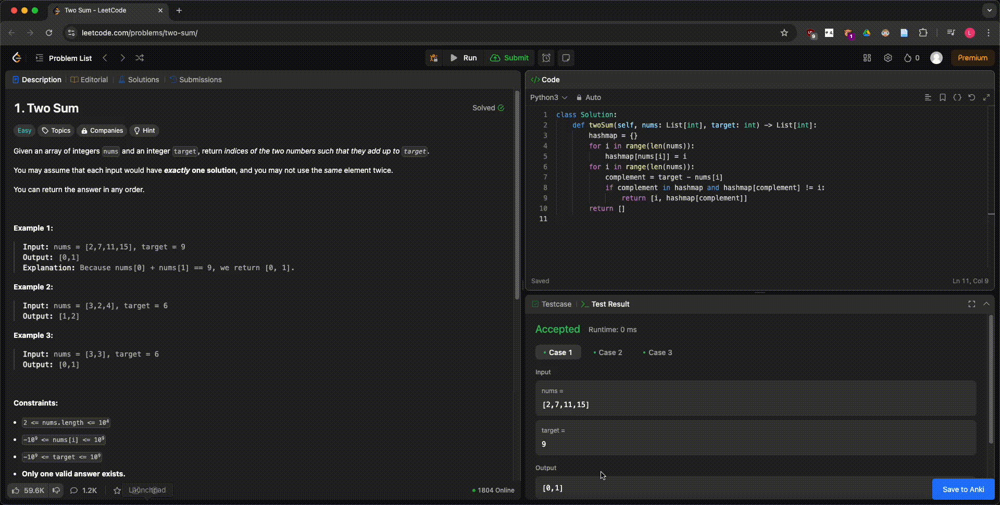

# LeetCode2Anki

LeetCode2Anki is a userscript that helps you add solved problems from LeetCode to your Anki decks for review and long-term retention. This script integrates seamlessly with Anki via AnkiConnect, allowing you to efficiently review programming problems and solutions later.



## Prerequisites

1. **Install Anki**
   - Download and install [Anki](https://apps.ankiweb.net/).
   - Ensure it’s running on your system when using the script.

2. **Install AnkiConnect**
   - Install the AnkiConnect plugin in Anki. 
   - [Download AnkiConnect](https://ankiweb.net/shared/info/2055492159) and follow the installation instructions.

3. **Install a Userscript Manager**
   - Install a userscript manager for your browser, such as:
     - [Tampermonkey](https://www.tampermonkey.net/)
     - [Violentmonkey](https://violentmonkey.github.io/)

4. **Install the LeetCode2Anki Userscript**
   - Once your userscript manager is installed, install the [LeetCode2Anki](https://raw.githubusercontent.com/krmanik/leetcode2anki/refs/heads/main/leetcode2anki.user.js) script.

## Installation Guide

1. **Install the Userscript**
   - Open your userscript manager (Tampermonkey/Violentmonkey).
   - Create a new userscript and paste the code of LeetCode2Anki into it.

2. **Customize Deck Name and Model**
   - Open the script in your userscript manager.
   - Modify the following constants to suit your needs:
     ```javascript
     const deckName = 'LeetCode';               // Customize your deck name here
     const modelName = 'Basic - LeetCode2Anki'; // Customize your model name
     const language = 'Python';                // Set your preferred language for LeetCode problems
     const langShortName = 'py';               // Short name for syntax highlighting, view https://speed-highlight.github.io/core/examples/
     ```
   - Supported languages include:  
     `['C++', 'Java', 'Python', 'Python3', 'C', 'C#', 'JavaScript', 'TypeScript', 'PHP', 'Swift', 'Kotlin', 'Go', 'Ruby', 'Scala', 'Rust']`

3. **Start Adding Problems to Anki**
   - Navigate to a solved problem on LeetCode.
   - Use the script's functionality (e.g., click the "Save to Anki" button) to add the problem to your Anki deck.

## How to Use

1. Solve a problem on [LeetCode](https://leetcode.com).
2. Click the "Save to Anki" button (added by the userscript) on the problem page.
3. The problem, along with its details and code, will be added to your Anki deck.

## License

This project is licensed under the GPL 2.0 License.

## Acknowledgements

- [LeetCode-Anki](https://github.com/Peng-YM/LeetCode-Anki)
- [Speed Highlight JS](https://github.com/speed-highlight/core)
